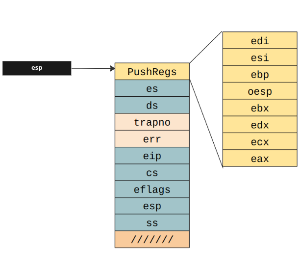
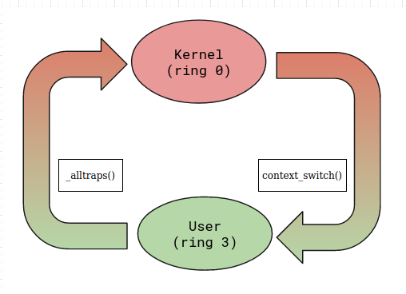
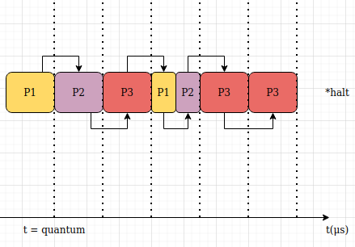

# sched.md

En el siguiente trabajo se desarrolla y explica las siguientes funcionalidades del kernel implementadas: el cambio 
de contexto y 2 formas de elegir el siguiente proceso a correr para el scheduler (i.e. planificador) sobre un sistema 
operativo preexistente. \
Se agregaron las funcionalidades a JOS, un exokernel educativo del MIT, que está diseñado para correr en la arquitectura
x86, Para ellos se utiliza QEMU para emular dicha arquitectura. 

Se muestra un enlace del trabajo práctico, de la materia Sistemas Operativos de la Universidad de Buenos Aires:\
https://fisop.github.io/website/tps/sched/

### Ejecucion del trabajo
Para correr las pruebas se debe cambiar el flag **CFLAG** del make file segun quiera elegirse correr con el planificador
Round Robin(RR) o la implementacion que agrega la funcinalidad de poder gestionar prioridades en los procesos.
Las opciones son:
*  ***CFLAG += -D R_R*** para RR
*  ***CFLAG += -D C_P*** para scheduler con prioridades

## Parte 1: Cambio de contexto

Un cambio de contexto ocurre cuando el kernel transfiere el control de la CPU de un proceso o mediante una interrupcion
el kernel vuelve a retomar el control. \
Para el cambio de contexto, el kernel guarda el contexto del proceso que es el conjunto de valores de registro de la CPU
y otros datos que describen el estado del proceso. Estos son guardados por el kernel en el atributo struct Trapfame env_tf
de dicho proceso.

    struct Env {
        struct Trapframe env_tf;	// Saved registers
        struct Env *env_link;		// Next free Env
        envid_t env_id;			// Unique environment identifier
        envid_t env_parent_id;		// env_id of this env's parent
        enum EnvType env_type;		// Indicates special system environments
        unsigned env_status;		// Status of the environment
        uint32_t env_runs;		// Number of times environment has run
        int env_cpunum;			// The CPU that the env is running on
        pde_t *env_pgdir;		// Kernel virtual address of page dir
      [...]
    }
 
Para correr un nuevo proceso, se tienen un par de consideraciones:
 
1) Si se trata de un cambio de contexto (se está ejecutando un nuevo proceso):

    • Si actualmente hay un proceso corriendo, hay que establecer su estado de "corriendo" a "corrible".
    • Se actualiza el proceso actual.
    • Se actualiza su contador de ejecuciones.
    • Se carga el pgdir correspondiente al proceso.

2) Realizamos un context switch para restaurar los registros del proceso y cambiar de ring 0 (kernel) a ring 3 (modo usuario).

    void
    env_run(struct Env *e)
    {
        if (curenv != e) {
            if (curenv)
                curenv->env_status = ENV_RUNNABLE;
            curenv = e;
            curenv->env_status = ENV_RUNNING;
            curenv->env_runs++;
            env_load_pgdir(curenv);
        }
        
        // Needed if we run with multiple procesors
        // Record the CPU we are running on for user-space debugging
        unlock_kernel();
        curenv->env_cpunum = cpunum();

        context_switch(&curenv->env_tf);
    }

La función context_switch está definida en el archivo kern/env.h como:

    void    context_switch(struct Trapframe *tf) __attribute__((noreturn));

Se observa que esta función recibe un puntero a una estructura Trapfame (mencionada anteriormente) y además no retorna,
ya que cede el control a dicho proceso.

La estructura Trapfame está definida de la siguiente forma:

    struct Trapframe {
        struct PushRegs tf_regs;    // Registros de uso general

        uint16_t tf_es;             // Registros de segmentación
        uint16_t tf_ds;

        uint32_t tf_trapno;         // Registros auxiliares el kernel. Usado para reconocer interrupciones y errores
        uint32_t tf_err;

        uintptr_t tf_eip;           // Nos dice donde estamos ejecutando código

        uint16_t tf_cs;             // Code Segment. Sus últimos 2 bits indican el nivel de privilegio actual
        uint32_t tf_eflags;         // Contiene bits de estado incluyendo algunas configuraciones

        uintptr_t tf_esp;           // Marca dónde está el stack (necesario para algunas instrucciones)
        uint16_t tf_ss;             // Stack segment

    } __attribute__((packed));

Se muestra gráficamente una representacion de las estructuras mencionadas: 

 
    

Al entrar en la función context_switch(tf), derivada a la rutina assembler definida en kern/switch.S, 
por convención, se pasa el punto de retorno de la función context_switch y la estructura Trapfame
a través del stack. Esto se puede corroborar en la siguiente captura, donde:

    •   0xf0103661 es el punto de retorno.
    •   0xf02cc000 es la dirección de memoria de la estructura Trapfame.

El objetivo es apuntar a la dirección de memoria del tf->eip para a partir de la instrucción privilegiada iret,
generar el cambio de contexto. A continuacion se detalla, los pasos para lograrlo:

Inicialmente, se mueve la posicion de registro esp a la posición del argumento de la funcion context_switch,
que es efectivamente la dirección de memoria del struct Trapframe. Esto se realiza salteándose el primer elemento del Stack.

Una vez realizado el cambio de dicha posición cambiamos los contenidos de los registros del CPU con los almacenados en 
el struct Trapframe. Los primeros registros modificados serán los de propósito general a través de la instrucción popal. 

Luego, cambiamos el contenido del registro %es y %ds por el del struct Trapframe.

A continuacion, se avanzó dos posiciones por delante, ya que estas corresponden a las propiedades trapno y err, 
que son auxiliares utilizados por el kernel y por lo tanto no se necesitan para realizar el cambio de contexto.

Por último, se actualizó los registros restantes que conforman al proceso, realizando el cambio de contexto al aplicar la
instruccion privilegiada iret que nos permite pasar de ring 0 a ring 3 actualizando dichos registros de la CPU con los valores
de la estructura Trapframe.

Al finalizar la implementation del cambio de contexto de modo kernel a modo usuario, permite la ejecución de procesos.
Teniendo en consideración que el kernel se inicializa con tres procesos de tipo "Hola mundo", podemos observar que el primero
de estos se ejecuta, arrojando los siguientes resultados.

Entrada
 
    $ make qemu-nox-gdb

Salida

    SeaBIOS (version 1.13.0-1ubuntu1.1)

    iPXE (http://ipxe.org) 00:03.0 CA00 PCI2.10 PnP PMM+07F8C8B0+07ECC8B0 CA00

    Booting from ROM..6828 decimal is 15254 octal!
    Physical memory: 131072K available, base = 640K, extended = 130432K
    check_page_free_list() succeeded!
    check_page_alloc() succeeded!
    check_page() succeeded!
    check_kern_pgdir() succeeded!
    check_page_free_list() succeeded!
    check_page_installed_pgdir() succeeded!
    SMP: CPU 0 found 1 CPU(s)
    enabled interrupts: 1 2
    [00000000] new env 00001000
    0xf01223f4
    [00000000] new env 00001001
    0xf01223f4
    [00000000] new env 00001002
    0xf01223f4
    hello, world
    i am environment 00001000
    [00001000] exiting gracefully
    [00001000] free env 00001000

Debug

    $ make gdb

Se muestra el estado final de registros al utilizar: info registers, que imprime los nombres y valores de todos los registros
excepto los registros de punto flotante (en el stack frame seleccionado).

    info registers
    

    
Informe de registros obtenidos al final de la ejecución:
    
| Registro  | Valor hexadecimal  | Valor decimal  |
|---|---|---|
|eax|0x0|0|
|ecx|0x0|0|
|edx|0x0|0|
|ebx|0x0|0|
|esp|0xeebfe000|0xeebfe000|
|ebp|0x0|0x0|
|esi|0x0|0|
|edi|0x0|0|
|eip|0x800020|0x800020|
|eflags|0x202|[ IOPL=0 IF ]|
|cs|0x1b|27|
|ss|0x23|35|
|ds|0x23|35|
|es|0x23|35|
|fs|0x23|35|
|gs|0x23|35|
|fs_base|0x0|0|
|gs_base|0x0|0|
|k_gs_base|0x0|0|
|cr0|0x80050033|[ PG AM WP NE ET MP PE ]|
|cr2|0x0|0|
|cr3|0x3bb000|[ PDBR=0 PCID=0 ]|
|cr4|0x10|[ PSE ]|
|cr8|0x0|0|
|efer|0x0|[ ]|

Registros adicionales observados: 

        xmm0           {v4_float = {0x0, 0x0, 0x0, 0x0}, v2_double = {0x0, 0x0}, v16_int8 = {0x0 <repeats 16 times>}, v8_int16 = {0x0, 0x0, 0x0, 0x0, 0x0, 0x0, 0x0, 0x0}, v4_int32 = {0x0, 0x0, 0x0, 0x0}, v2_int64 = {0x0, 0x0}, uint128 = 0x0}
        xmm1           {v4_float = {0x0, 0x0, 0x0, 0x0}, v2_double = {0x0, 0x0}, v16_int8 = {0x0 <repeats 16 times>}, v8_int16 = {0x0, 0x0, 0x0, 0x0, 0x0, 0x0, 0x0, 0x0}, v4_int32 = {0x0, 0x0, 0x0, 0x0}, v2_int64 = {0x0, 0x0}, uint128 = 0x0}
        xmm2           {v4_float = {0x0, 0x0, 0x0, 0x0}, v2_double = {0x0, 0x0}, v16_int8 = {0x0 <repeats 16 times>}, v8_int16 = {0x0, 0x0, 0x0, 0x0, 0x0, 0x0, 0x0, 0x0}, v4_int32 = {0x0, 0x0, 0x0, 0x0}, v2_int64 = {0x0, 0x0}, uint128 = 0x0}
        xmm3           {v4_float = {0x0, 0x0, 0x0, 0x0}, v2_double = {0x0, 0x0}, v16_int8 = {0x0 <repeats 16 times>}, v8_int16 = {0x0, 0x0, 0x0, 0x0, 0x0, 0x0, 0x0, 0x0}, v4_int32 = {0x0, 0x0, 0x0, 0x0}, v2_int64 = {0x0, 0x0}, uint128 = 0x0}
        xmm4           {v4_float = {0x0, 0x0, 0x0, 0x0}, v2_double = {0x0, 0x0}, v16_int8 = {0x0 <repeats 16 times>}, v8_int16 = {0x0, 0x0, 0x0, 0x0, 0x0, 0x0, 0x0, 0x0}, v4_int32 = {0x0, 0x0, 0x0, 0x0}, v2_int64 = {0x0, 0x0}, uint128 = 0x0}
        xmm5           {v4_float = {0x0, 0x0, 0x0, 0x0}, v2_double = {0x0, 0x0}, v16_int8 = {0x0 <repeats 16 times>}, v8_int16 = {0x0, 0x0, 0x0, 0x0, 0x0, 0x0, 0x0, 0x0}, v4_int32 = {0x0, 0x0, 0x0, 0x0}, v2_int64 = {0x0, 0x0}, uint128 = 0x0}
        xmm6           {v4_float = {0x0, 0x0, 0x0, 0x0}, v2_double = {0x0, 0x0}, v16_int8 = {0x0 <repeats 16 times>}, v8_int16 = {0x0, 0x0, 0x0, 0x0, 0x0, 0x0, 0x0, 0x0}, v4_int32 = {0x0, 0x0, 0x0, 0x0}, v2_int64 = {0x0, 0x0}, uint128 = 0x0}
        xmm7           {v4_float = {0x0, 0x0, 0x0, 0x0}, v2_double = {0x0, 0x0}, v16_int8 = {0x0 <repeats 12 times>, 0x80
        0x0, 0x0}, v8_int16 = {0x0, 0x0, 0x0, 0x0, 0x0, 0x0, 0x1f80, 0x0}, v4_int32 = {0x0, 0x0, 0x0, 0x1f80}, v2_int64 = {0x0 0x1f8000000000}, uint128 = 0x1f80000000000000000000000000}
        mxcsr          0x1f80              [ IM DM ZM OM UM PM ]

## Context switch: Traps

Una vez implementado la función context_switch, es posible el cambio de ring 0 a ring 3. En el siguiente se desarrolla 
el método de cambio de contexto de modo usuario a modo kernel (ring 3 a ring 0), es decir la inversa de lo implementado
anteriormente, a través de desarrollar la implementacion de interrupciones del tipo trap, ya que la instrucción iret es 
privilegiada y no podríamos utilizarla para dicho objetivo. \
Se desarrolla, a continuación, la función **_alltraps** definida en kern/trapentry.S:

 
    

**_alltraps** realiza el camino inverso a context_switch, por ende es fácil su entendimiento luego de lo explicado anteriormente.
Visualizando la estructura de Trapfame, se observa que los registros ds y es son recuperados a partir de un descriptor 
del kernel, este es GD_KD que corresponde a 0x10 según inc/memlayout.h.

    #define GD_KD     0x10     // kernel data

A partir de lo anterior:

    _alltraps:
        pushl %ds;
        pushl %es;
        pushal;

        # Load de kernel data guardada en descriptor = GD_KD
        mov $GD_KD, %ax;
        mov %ax, %ds;
        mov %ax, %es;

        pushl %esp;
        # esp = &trapframe
        call trap;
	
 # Parte 2: Scheduling
 
El objetivo es desarrollar un planificador de tipo Round-Robin para el kernel. \
Round-Robin(RR) es un algoritmo de planificación de procesos simple de implementar, dentro de un sistema operativo se 
asigna a cada proceso una porción de tiempo equitativa y ordenada, llamada quantum, tratando a todos los procesos con la
misma prioridad, por eso se dice que es justo. \
Se muestra un diagrama sobre el flujo del planificador para este:

 
    

Se implementó el scheduler mencionado, tomando la decision del siguiente a correr
a partir del vector de procesos existentes en el kernel:

	extern struct Env *envs; // All environments
	
Para ello se tiene en cuenta:
	
	• Si existe un proceso actual, se consigue su índice en el array envs, y se pasa al siguiente.
	
	• Si no hay un proceso actual, el índice inicial va a ser el 0.
	
	• Se empieza a buscar en el array envs (a partir del índice calculado) un proceso que esté en condiciones de ser corrido.
	
    • Si se encuentra un proceso, este simplemente se ejecuta con env_run(env);
		
    • Si no se encuentra un proceso, los casos son:
			
        - Si el proceso actual sigue corriendo, entonces está bien que continúe con él
			
        - Si no quedan procesos existentes, el scheduler se detiene a partir de la función sched_halt(),
			que entre otras cosas, entra en el monitor del kernel.
	
Se muestra el código desarrollado en kern/sched.c :

	void
	sched_yield(void)
	{	
		size_t env_id = 0;
		if (curenv)							   				
			env_id = ENVX(curenv->env_id) + 1;

		for (int i = 0; i < NENV; i++) {			
			const size_t array_index = (env_id + i) % NENV;
			if (envs[array_index].env_status == ENV_RUNNABLE)   // cuando array_index = NENV.
				env_run(&envs[array_index]);					
		}
		
		if (curenv && curenv->env_status == ENV_RUNNING)
			env_run(curenv);
			
		sched_halt();
	}

 # Parte 3: Scheduling con Prioridades
 
El objetivo de esta parte, es que los procesos puedan tener prioridades para que el scheduler pueda decidir cuál será el 
siguiente a correr teniéndolas en cuenta. Para ello, se debe reemplazar la implementación de RR explicada en el punto 
anterior mediante la directiva del precompilador #ifdef para elegir cuál de las 2 se utilizara en el momento de ejecución.

Elegimos tener 3 distintas prioridades, siendo la de maxima importancia para el planificador el 3 y es con la que todos 
los procesos inicializan. 

Para proveer dicha funcionalidad se agregaron 2 syscall a la libreria:
 * sys_get_priority(envid_t envid): Retorna la prioridad del proceso pasado por argumento.
 * sys_decrement_priority(envid_t envid): Decrementa la prioridad del proceso pasado por argumento.
 
Con dichas funcionalidades, los programas de usuario, solo podrán saber su prioridad o reducirla. Al llamar a la syscall
se producirá un cambio de contexto que realizara dicha operación. La reducción nunca será menor a 1, ya que es la minima
prioridad existente en nuestro sistema.

Las reducciones de prioridad solo suceden cuando:
* Un usuario lo solicita mediante la syscall mencionada
* Un proceso crea otro mediante la syscall **fork**. El proceso hijo heredará la prioridad 
del padre y, además, se le reducirá en una unidad de prioridad al padre. Se realizó esta 
decision, debido a que esperamos que el proceso hijo termine antes el hijo, para no quedar 
huérfano.

Para poder probar nuestro planificador, se agregan las siguientes métricas:
* Cantidad de cambios de contexto.
* Cantidad de ejecuciones de un proceso.
* Cantidad de interrupciones de un proceso: Muestra la cantidad de veces que se interrumpió
dicho proceso debido a una reducción del mismo
* Historial de ejecución del scheduler. Para esto se inicializó un puntero de struct Env*
  y se reservó memoria con la función memset()

Estas se imprimirán a medida que corramos la misma.

Se crearon o modificaron los siguientes programas 
de usuario:
* reduce1: Al cual se le reduce la prioridad 1 vez.
* reduce2: Al cual se le reduce la prioridad 1 vez.
* hello: Al cual se le reduce la prioridad 1 vez o ninguna.

En el siguiente gráfico, se muestra un ejemplo de una posible prueba, con un proceso hello
al cual se le baja la prioridad 1 vez:
 
 
 
Se observan 3 procesos, inicialmente instanciados con la maxima prioridad 3, luego se 
realiza una reducción de prioridad de reduce1 cediendo el control al scheduler quien decide
ejecutar reduce2, realizando lo mismo, y por último se procede con hello de la misma forma

Luego, al no haber más procesos con prioridad 3 se procede a ejecutar los procesos con la 
siguiente prioridad (2), ejecutándose reduce1, luego reduce 2 que reducirá su prioridad una
vez más cediendo el control al scheduler quien decidirá ejecutar hello. 

Em este punto reduce1 y hello habrán terminado su ejecución, y al no haber procesos con 
prioridad 2 o 3, se procederá a ejecutar procesos con la minima prioridad (1),
terminando asi el procedimiento de elecciones.

A continuación, se muestra el historial de los procesos al ejecutar 5: 3 procesos 
hello, un proceso reduce1 y un reduce2.

Todos estos programas contienen una llamada a for luego de la syscall, para no terminar
rápidamente su ejecución y poder realizar la prueba.

Se observa que se realizaron 11 context switch en total y que:
* El proceso con id = 4096 tuvo 1 interrupcion pues bajo 1 prioridad y 4 context switch.
* El proceso con id = 4097 tuvo 2 interrupciones pues bajo 2 veces su prioridad 
y 2 context switch.
* El proceso con id = 4098, 4099 y 4100 tuvieron 0 interrupciones y 0 context switch,
pues se ejecutaron una única vez.

Podemos observar que hubo 7 context switch debido al cambio de prioridad, los restantes
se deben a interrupciones del tipo timer para que el kernel pueda retomar el control 
del CPU.
